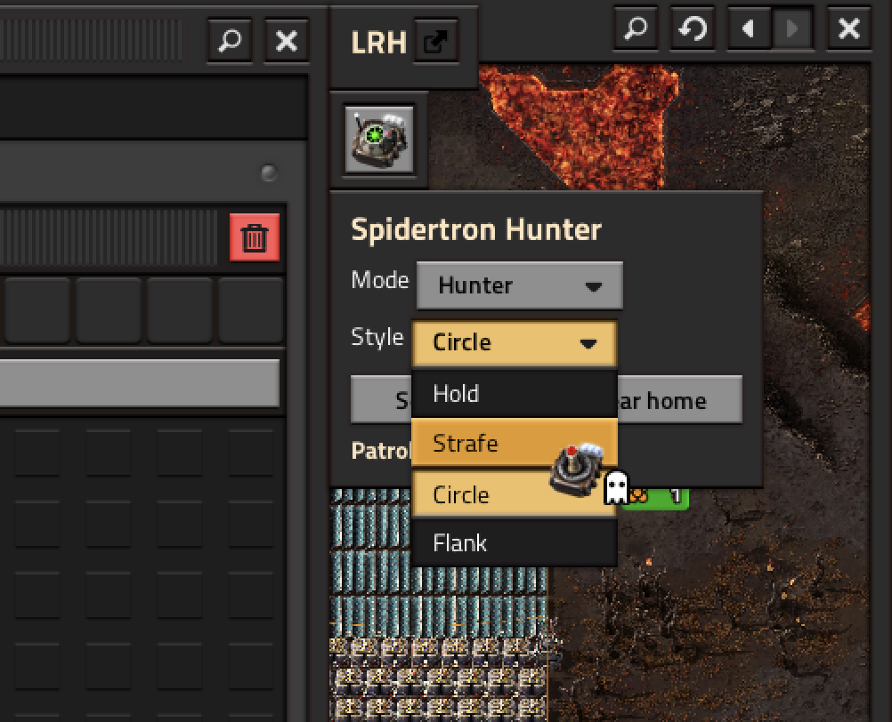
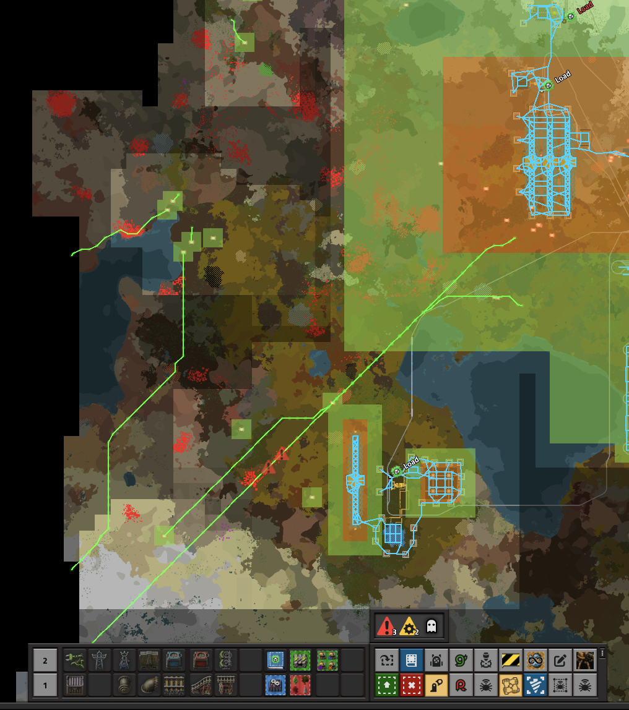
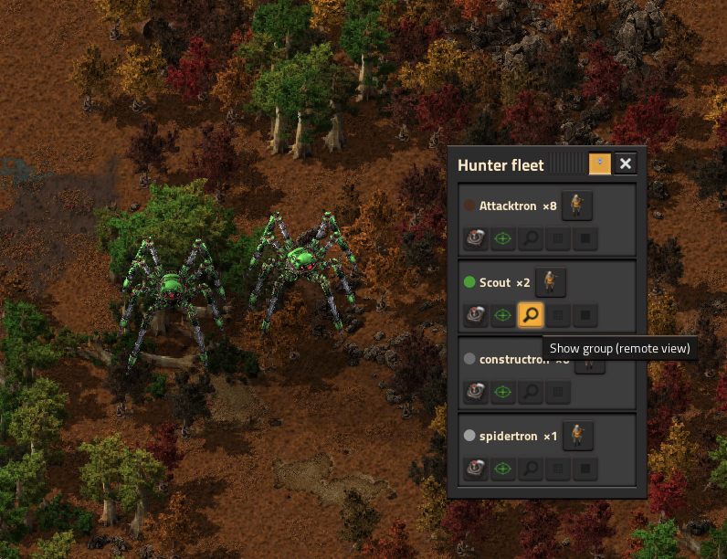

# Spidertron Hunter

Autonomous Spidertron AI for **Factorio 2.1**.

**Hunter** mode searches for enemies, paths around lakes, kites at range, retreats when damaged or low on ammo, then returns home to restock/repair.

**Scout** mode explores and charts fog without engaging — keeps standoff from biters, feeds the shared enemy cache, then hunters can clean up.

**Fleet manager** groups spidertrons on your surface for follow, remote, home, and AI controls.

## Gallery


*Multi-select activation — toggle Hunter AI on several spidertrons at once.*



*Per-spidertron combat style: Hold / Strafe / Circle / Flank.*



*Scout mode — lake-aware paths charting fog while keeping standoff from biters.*



*Fleet manager — groups on the current surface with follow, remote, home, AI (Ctrl-click Scout), and role counts.*

## Requirements

- Factorio **2.1** only (development and releases target 2.1 going forward; 2.0 is not supported)
- [Spidertron Hunter on the Mod Portal](https://mods.factorio.com/mod/SpidertronHunter)
- Optional: [Spidertron Patrols](https://mods.factorio.com/mod/SpidertronPatrols), [Spidertron Enhancements](https://mods.factorio.com/mod/SpidertronEnhancements), Space Age

## How to use

1. Unlock spidertrons (and the Hunter toolbar shortcut).
2. Select one or more spidertrons with the remote (or open a spidertron GUI).
3. Set **Mode** on the spidertron GUI: **Off** / **Hunter** / **Scout**.
4. Or toggle Hunter via toolbar **Toggle Spidertron Hunter** / `Ctrl+Shift+H` (enables Off spiders as Hunter; does not convert Scouts).
5. Home is set to the spidertron's position when AI is enabled.
6. Per-hunter combat style via the Style dropdown (Hunter mode only).
7. **Right-click** with a remote → straight vanilla path. **Ctrl+right-click** → lake-aware path (ground: travel then hunt from there; enemy: path then fight).

### Scout controls

1. Set Mode → **Scout** (or fleet manager AI **Ctrl-click** for Off members).
2. **Vanilla spidertron remote** click → set explore **focus** (clears waypoints; runs the map-setting algorithm around that point).
3. **Scout remote** (toolbar / `Alt+Shift+A`) click → **append waypoint**. Waypoints are visited in order (algorithm ignored until the queue is empty).
4. **Ctrl+right-click** with a remote → lake-aware path (Scout remote adds a waypoint; vanilla remote sets focus). Plain right-click does not force an immediate lake-aware path.
5. Map settings choose the algorithm: `frontier` (nearest fog), `lawnmower`, or `spiral`.

### Fleet manager

Open with the **Hunter fleet** toolbar shortcut or `Ctrl+Shift+M`. Lists all spidertrons on your current surface, grouped by **entity label** (or prototype name if unlabeled). Active Hunter/Scout counts appear under the group name (e.g. `2H, 1S`).

Each group card:

| Control | Action |
|---------|--------|
| Follow (player icon) | Group follows you (AI pauses in place; still enabled) |
| Remote | Puts a spidertron remote in the cursor with that group selected |
| Home | Go home. **Ctrl-click** = set each spider's home to its **current** position |
| Show group | Remote-view camera to the group |
| Settings | Opens one spidertron's GUI (Mode / Style / home) |
| AI toggle | Enable Off as Hunter if any are off; disable if all are on (does not convert active Scouts). **Ctrl-click** = enable Off members as Scout (armed spiders refused) |
| Pin (titlebar) | Keep the window open while using remotes or spider GUIs |

Follow and go-home do **not** turn AI off — use the AI toggle (or Mode → Off) for that.

## Behavior

### Hunter

```
Patrol → Search → Move → Attack (kite) → linger / retreat / low ammo → Return home → Restock → (optional re-engage) → Patrol
```

- **Search:** bounded radius scans + shared enemy cache (not the whole map)
- **Move:** vanilla autopilot, lake-aware via `request_path` when needed
- **Attack:** preferred combat range; styles `hold` / `strafe` / `circle` / `flank`; acid puddle avoidance
- **Retreat:** configurable hull/shield % threshold forces a return home
- **Low ammo:** when on-hand ammo drops to Restock ammo % of the logistic ammo request (default 20; 0 off), return home while away from base (fallback: ammo count at enable)
- **Re-engage:** optional; after retreat + restock, return to the retreat origin and hunt again (default off)
- **Linger:** after a fight clears, keep scanning locally briefly (default 15s) before returning home
- **Restock:** waits on logistics/repairs with a hard timeout (never stuck forever); waits until ammo requests are filled when possible

### Scout

```
Explore → Move (lake-aware) → chart / standoff → (limits or done) → Return home → Restock → resume or wait
```

- Never enters combat; guns stay passive. Requires empty ammo (and no personal laser defense); enabling Scout is refused if armed, and Scout aborts if ammo is loaded mid-run.
- Charts fog each think tick; records nearby enemies into the shared cache
- Caps: max distance from focus/home, max run time, standoff distance
- If a scout keeps zig-zagging or looping in one area, it is standoff-dodging locals — send a Hunter squad to clear them so the scout can move on. Scouts also blacklist a blocked corridor briefly so they try a different route instead of oscillating.

## Settings

All important options are **runtime-global** (Map settings → Mod settings):

| Setting | Purpose |
|---------|---------|
| Search radius / max pursuit | How far to look / how far from home to chase |
| Scan interval / budget | UPS-facing scan throttles |
| Return home + post-combat linger | Clear an area before heading home (default linger 15s) |
| Sticky home on first enable | Keep home across disable/enable until cleared (default off) |
| Tactical retreat health % + shields | Bail out before dying |
| Restock ammo % | Return home when ammo is low vs logistic request (default 20; 0 off) |
| Re-engage after retreat | Return to retreat coordinates after restock (default off) |
| Combat range / style / acid avoid | Kiting behavior |
| Restock / repair / max wait | Home logistics |
| Scout algorithm / max distance / max time | Explore pattern and run caps |
| Scout standoff / chart radius / auto-resume | Safety distance, fog reveal, resume after waypoints/restock |

## Remote interface

```lua
/c remote.call("spidertron_hunter", "debug")
/c remote.call("spidertron_hunter", "reset")
/c remote.call("spidertron_hunter", "scan")
/c remote.call("spidertron_hunter", "enable", game.player.selected)
/c remote.call("spidertron_hunter", "disable", game.player.selected)
/c remote.call("spidertron_hunter", "set_role", game.player.selected, "scout")
/c remote.call("spidertron_hunter", "get_role", game.player.selected)
/c remote.call("spidertron_hunter", "set_scout_focus", game.player.selected, {x=0, y=0})
/c remote.call("spidertron_hunter", "add_scout_waypoint", game.player.selected, {x=100, y=0})
/c remote.call("spidertron_hunter", "clear_scout_waypoints", game.player.selected)
/c remote.call("spidertron_hunter", "follow_player", game.player.selected, game.player)
/c remote.call("spidertron_hunter", "return_home", game.player.selected)
```

Alias: `SpidertronHunter` (same methods).

## Compatibility

Spidertron Hunter is an independent project. It is not a fork of, and is not intended as a replacement for, [Spidertron Patrols](https://mods.factorio.com/mod/SpidertronPatrols) or [Spidertron Enhancements](https://mods.factorio.com/mod/SpidertronEnhancements).

Those mods are listed as optional dependencies. When they are installed, Spidertron Hunter enables optional compatibility features where appropriate (for example, forcing Spidertron Patrols to manual while Hunter AI is enabled and restoring automatic on disable when prior mode is known, and remapping AI state if a spidertron entity is replaced).

**0.1.11:** While Hunter AI is enabled, Patrols is switched to manual so the two mods do not fight over autopilot destinations. Disabling Hunter restores automatic only when the schedule was auto before (otherwise it stays manual).

## Development

This project is developed with AI-assisted tooling. All architecture, testing, and release decisions are reviewed before publication.

See [CONTRIBUTING.md](CONTRIBUTING.md) for setup, tests, packaging, and PR expectations. Maintainers: [docs/releasing.md](docs/releasing.md). Mod Portal description paste: [docs/mod-portal.md](docs/mod-portal.md).

### Tests

```bash
lua tests/run.lua
```

### Packaging for Mod Portal

```bash
./scripts/package_mod.sh dist
# → dist/SpidertronHunter_<version>.zip
```

GitHub Actions:
- `.github/workflows/test.yml` — runs pure Lua tests on push/PR
- `.github/workflows/release.yml` — on `v*` tags (or manual dispatch), builds `SpidertronHunter_0.x.x.zip` and attaches it to a GitHub Release

## Install (dev)

Symlink or copy this folder into your Factorio `mods` directory as `SpidertronHunter`.

## License

MIT — see [LICENSE](LICENSE).

Third-party attributions for adapted code (where applicable) are listed in [NOTICE](NOTICE).
